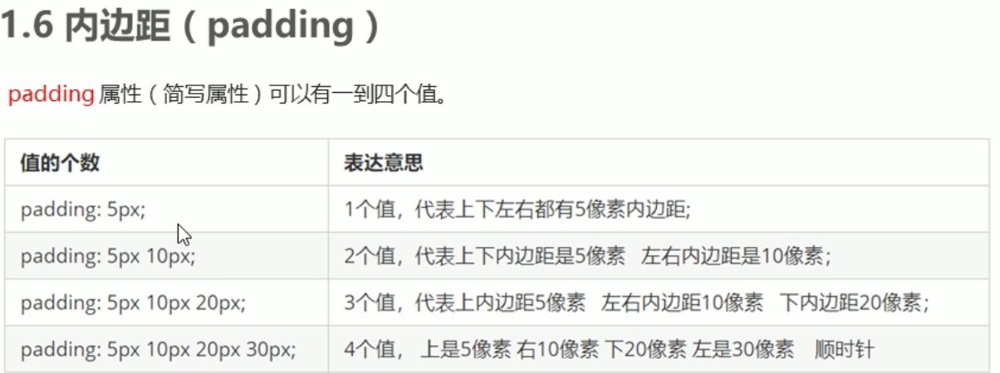
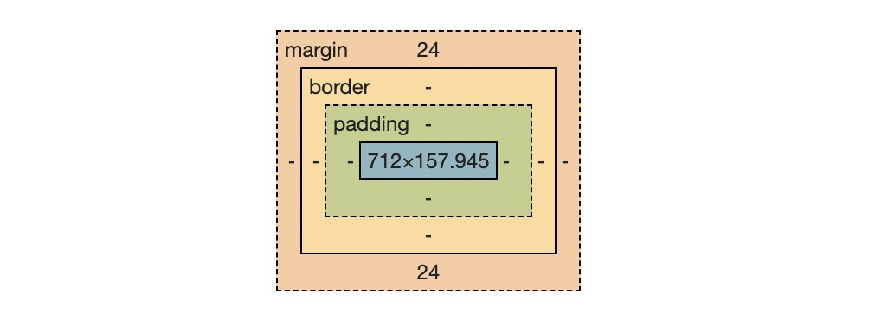

盒子模型

1. 盒子的4个组成部分
2. 能够利用边框复合写法给元素添加边框
3. 能够计算盒子的实际大小
4. 能够利用盒子模型布局模块案例
5. 能够给盒子设置圆角边框、添加阴影
6. 能够给文字添加阴影

知识点

盒子模型
圆角边框
盒子阴影
文字阴影

页面布局的三大核心
盒子模型、浮动、定位

网页布局过程
1 准备好相关网页元素 网页元素基本都是盒子
2. 利用CSS设置好盒子样式、然后摆放到相应位置
3. 向盒子里装内容

盒子模型的组成部分
边框  内外边距  实际内容

外边距(margin)盒子和盒子的距离

内边距(padding) 内容和盒子之间的距离

盒子模型如下

清除内外边距

很多网页元素自带内外边距，浏览器不一样 值也可能不一样 所以要清除

*{

    padding:0;
    margin:0;
}

