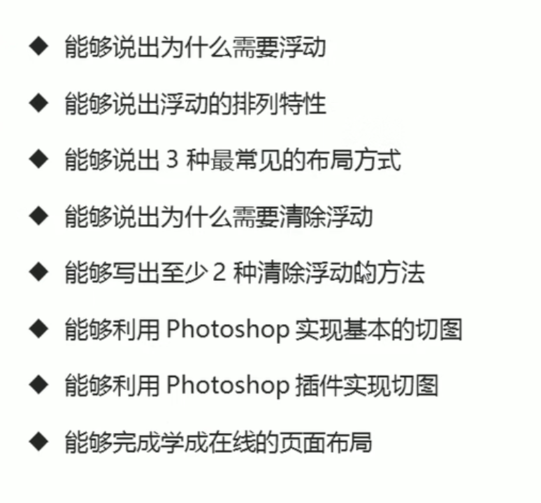
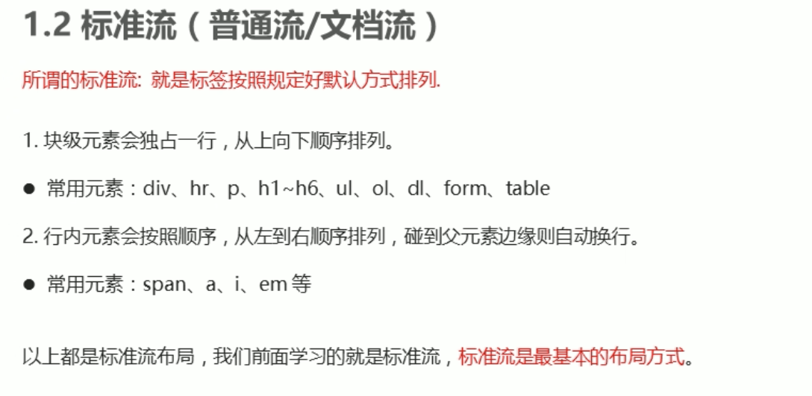
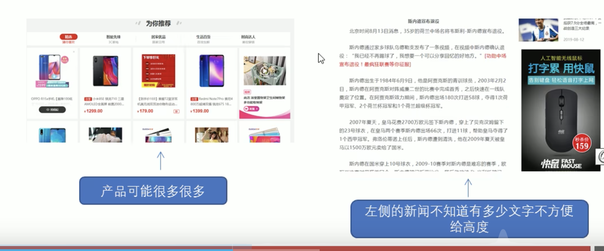
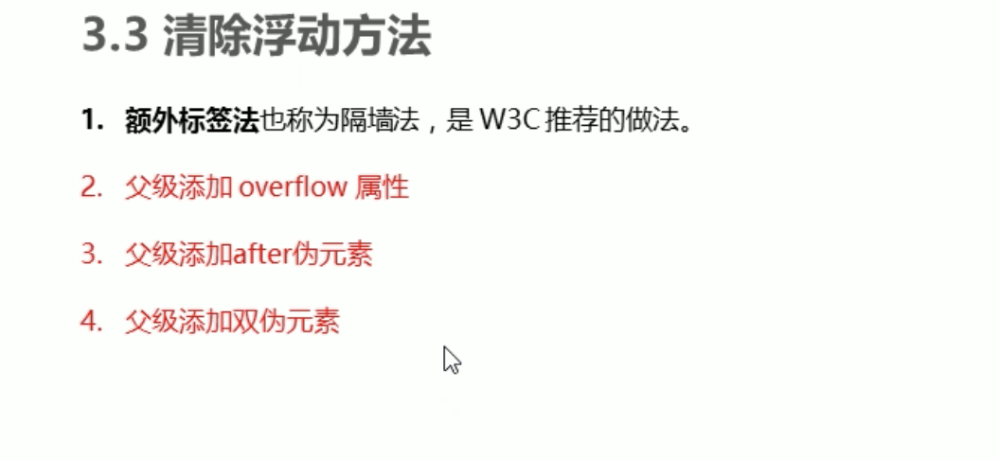

目标



网页布局的三种方式



网页布局第一准则：多个块级元素纵向排列找标准流，多个块级元素横向排列找浮动


什么是浮动
浮动的框可以向左或向右移动,直到它的外边缘碰到包含框或另一个浮动框的边框为止


浮动的特性

加了浮动 会有很多特性
1:浮动元素会脱离标准流 
```
脱离标准普通流的控制 移动到指定位置
浮动的盒子不再保留原先的位置
```


2:浮动元素会一行内显示并且元素顶部对齐

3:浮动元素会具有行内块元素的特征
任何元素都可以浮动，不管原先是什么模式的元素,添加浮动之后具有行内块元素相似的特性


浮动布局注意点
1.浮动和标准流的父盒子搭配
先用标准流的父元素排列上下位置，之后内部子元素采取浮动排列左右位置

2 一个元素浮动了,其余兄弟元素都要浮动


3 浮动的盒子只会影响浮动盒子后面的标准流，不会影响前面的标准流


所有的父盒子都应该有高度吗

 1 京东列表产品列表 下拉加载
 2 文章内容



理想中的状态，让纸盒子撑开父亲,有多少孩子,我父盒子就有多高

清除浮动
本质：清除浮动元素造成的影响
清除浮动后，父级就会根据浮动的子盒子自动检测高度,父级有了高度,就不会影响下面的标准流了


清除浮动语法

选择器{clear:属性值} clear:both



