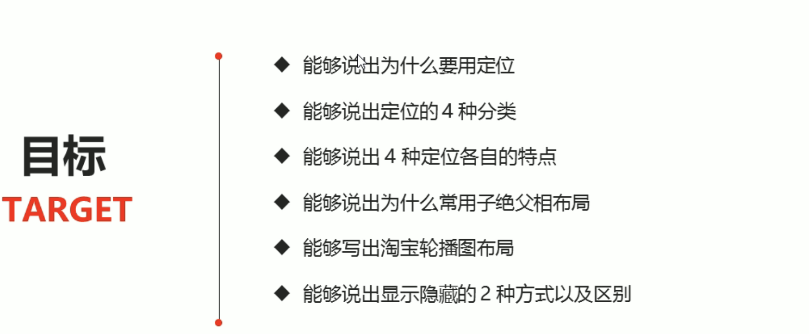
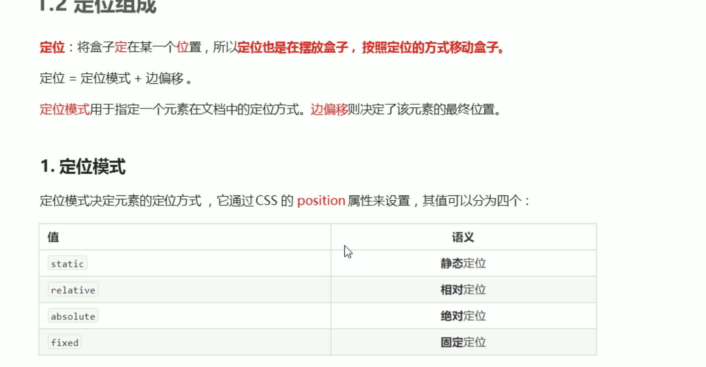
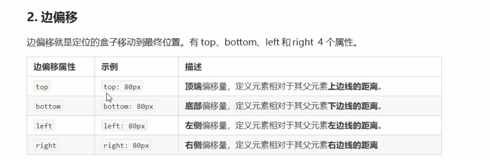
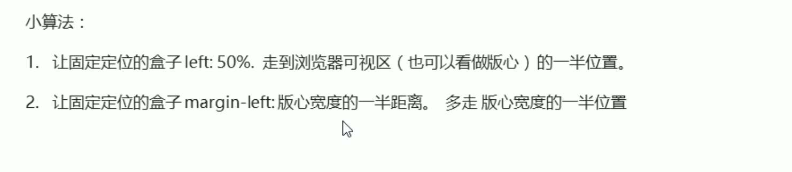
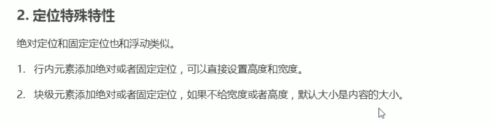
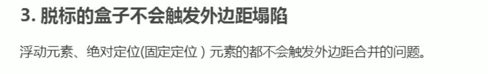

footer

定位

什么是定位 为什么需要定位

场景
以下情况使用标准流或者浮动能实现吗？
1. 某个元素可以自由的在一个盒子内移动位置 并且压住其他盒子
2. 当我们滚动窗口的时候，盒子是固定屏幕某个位置的

边偏移

相对定位:不脱标 继续保留原来位置
绝对定位(特点):
1. 如果没有祖先元素或者祖先元素定位  则已浏览器为准定位
2. 如果祖先元素有定位(相对 绝对 固定定位) 则以最近一级的有定位祖先元素为参考点移动位置
3. 绝对定位不再占有原来的位置 脱标

固定定位：
固定定位是元素固定于浏览器可视区的位置 主要使用场景:可以在浏览器页面滚动时
选择器{
    position:fiexd
}
小技巧：固定在版心右侧位置
算法：

什么时候使用相对定位，绝对定位   有哪些使用场景   可以在浏览器页面滚动时元素的位置不会改变

子绝父相

如果子级使用绝对定位  父级则需要使用相对定位

定位的特殊特性

 

