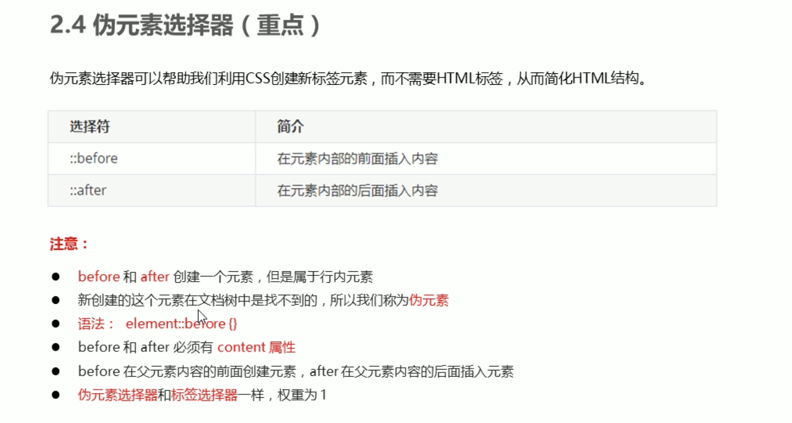

H5新特性：结构标记（header，nav footer，section，article，aside，），新表单元素（url，email，number，date，month，color等），canvas，audio，video，地理定位，拖放，web存储，Web Workers，WebSocket等。
CSS3新特性：复杂选择器器（属性选择器，伪类选择器，伪元素选择器，兄弟选择器等），边框倒角，边框阴影，渐变，转换，过渡，动画，弹性盒子，媒体查询技术等。

伪元素选择器
