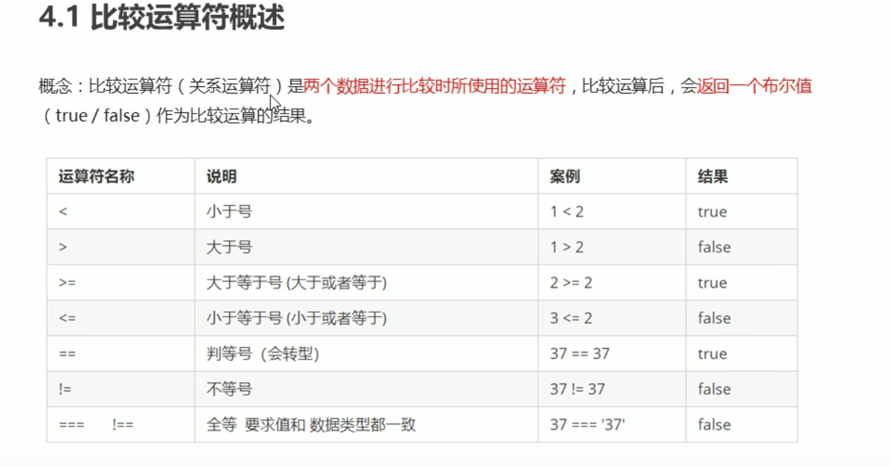
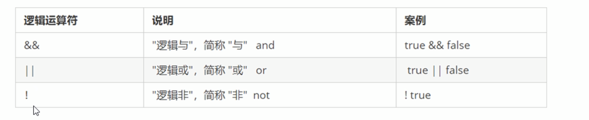

 

 

 在JS中数据类型主要分为2大类
 简单数据类型(number string boolean undefunined NULL)

NAN 非数字

 复杂数据类型(object)

 比较运算符
  

逻辑运算符
  

  js的作用域
  es6之前  全局作用域 和局部作用域

  全局作用域
  var index=0

    局部作用域
    函数内部就是局部作用域

    es6后新增块级作用域
    块级作用域{}

作用域链

JS的预解析

JS在运行代码时分成2步：预解析和代码执行

对象

